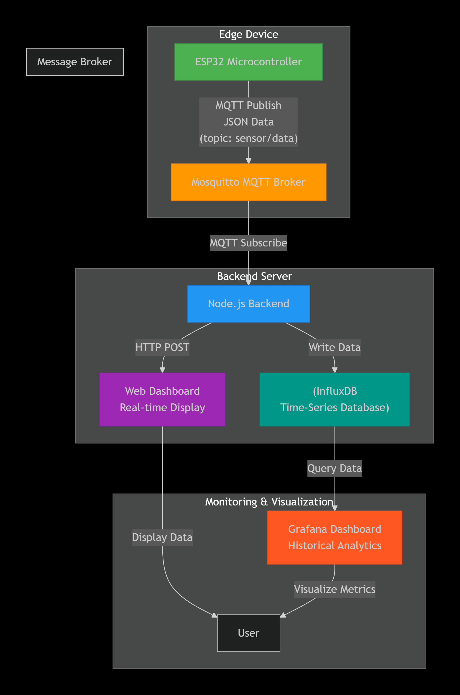

# 📡 IoT Server Stack – MQTT, InfluxDB & Grafana


Sebuah **IoT backend server stack** yang digunakan untuk menerima, memproses, menyimpan, dan memvisualisasikan data dari perangkat **ESP32** secara real-time.

Proyek ini dibuat sebagai **technical showcase** untuk membuktikan pengalaman langsung menggunakan teknologi backend IoT modern berbasis **MQTT, Node.js, InfluxDB, Grafana, dan Docker**.

> 💡 Fokus proyek ini adalah integrasi sistem, data flow IoT, dan deployment service — bukan sekadar demo kode.

---

## 🔧 Fitur Utama

- ✅ MQTT Broker menggunakan **Mosquitto**
- ✅ Data publish dari ESP32 ke server
- ✅ Backend **Node.js** sebagai MQTT subscriber & data handler
- ✅ Penyimpanan data time-series menggunakan **InfluxDB**
- ✅ Visualisasi data real-time & historis dengan **Grafana**
- ✅ Multi-service deployment menggunakan **Docker Compose**
- ✅ Konfigurasi environment terpisah (credential & token tidak terekspos)
- ✅ Siap dikembangkan ke sistem notifikasi & web dashboard

---

## ⚙️ Teknologi yang Digunakan

- **ESP32** – IoT device & data publisher
- **MQTT (Mosquitto)** – lightweight message broker
- **Node.js** – backend service & data processor
- **InfluxDB** – time-series database
- **Grafana** – monitoring & visualization dashboard
- **Docker & Docker Compose** – service orchestration

---
## 🏗️ System Architecture

Sistem dibangun dengan arsitektur modular & containerized, di mana setiap komponen berjalan sebagai service terpisah di dalam Docker.




---
## 📡 Cara Kerja Singkat

1. ESP32 mengirim data sensor melalui protokol MQTT
2. Mosquitto menerima dan meneruskan data
3. Backend Node.js subscribe topic MQTT
4. Data diproses lalu disimpan ke InfluxDB
5. Grafana membaca data dari InfluxDB dan menampilkan grafik

---

## 🚀 Menjalankan Server

### Prasyarat
- Docker
- Docker Compose
  
### Menjalankan semua service
```bash
docker compose up -d
```

## Screenshots

